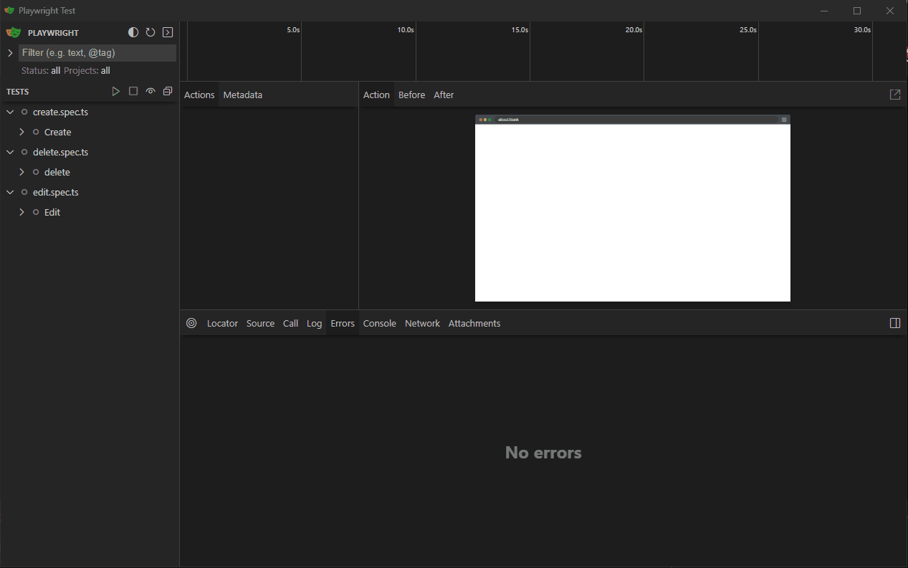
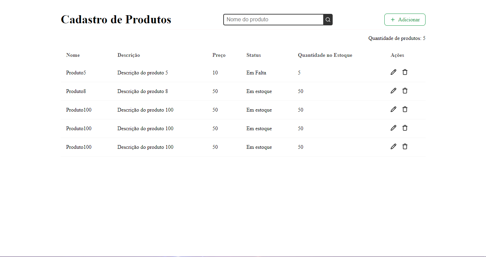
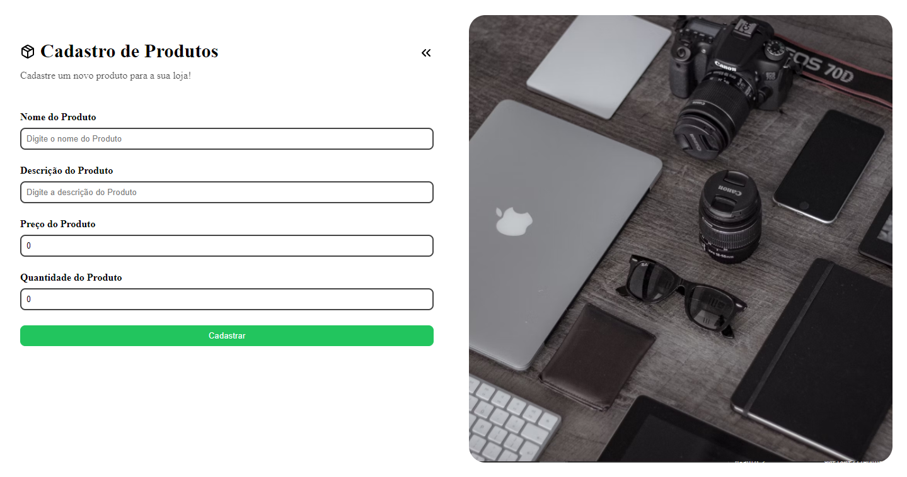

## Projeto CRUD Bevi

Este é um projeto CRUD simples utilizando React para a construção da interface do usuário (UI) e Playwright para testes automatizados. O objetivo é criar, ler, atualizar e excluir (CRUD) produtos de uma loja fictícia chamada Bevi.

## Pré-requisitos
Antes de iniciar a instalação, certifique-se de ter as seguintes ferramentas instaladas em seu sistema:

- <a target="_blank" href="https://nodejs.org/en">Node.js</a>
- <a target="_blank" href="https://www.git-scm.com/downloads">Git</a>

## Tecnologias Utilizadas

- <a target="_blank" href="https://react.dev">React</a>: Biblioteca JavaScript para construção de interfaces de usuário.
- <a target="_blank" href="https://playwright.dev">Playwright</a>: Ferramenta de automação de teste para aplicativos da web.
- <a target="_blank" href="https://tanstack.com">@tanstack/react-query</a>: Biblioteca para gerenciamento de estado e cache de dados na aplicação React.
- <a target="_blank" href="https://zod.dev">Zod</a>: Biblioteca para validação de esquemas de dados.
- <a target="_blank" href="https://www.react-hook-form.com">React Hook Form</a>:  Biblioteca para gerenciamento de formulários em aplicações React
- <a target="_blank" href="https://sass-lang.com">Sass</a>:  SASS é uma linguagem de extensão do CSS
- <a target="_blank" href="https://sonner.emilkowal.ski">Sonner</a>: Biblioteca para exibir notificações na aplicação.

## Funcionalidades

- **Listagem de Produtos**: Visualização dos produtos cadastrados na loja.
- **Cadastro de Produtos**: Adição de novos produtos ao estoque.
- **Edição de Produtos**: Atualização das informações de um produto existente.
- **Exclusão de Produtos**: Remoção de produtos do estoque.

### Como Utilizar

1. **Instalação**: Clone o repositório e instale as dependências utilizando npm ou yarn:
    ```bash
      git clone https://github.com/seu-usuario/crud-bevi.git
      cd crud-bevi
      npm install
    ```

2. **Execução do Servidor de Desenvolvimento**: Execute o servidor de desenvolvimento para visualizar a aplicação no navegador:

    ```bash
      npm run dev
    ```

3. **Execução dos Testes Automatizados:**: Execute os testes automatizados utilizando o Playwright:

    ```bash
      npm test
    ```

## Componentes
### `Header`

O componente `Header` é responsável por exibir o cabeçalho da página, incluindo o título "Cadastro de Produtos" e um campo de busca.

### Exemplo de Uso
```tsx
import { Plus, Search } from "lucide-react";

import { useState } from "react";
import { Link, useSearchParams } from "react-router-dom";
import styles from "./header.module.scss";

export function Header() {
  const [search, setSearch] = useState<string>("");
  // eslint-disable-next-line no-unused-vars
  const [_, setSearchParams] = useSearchParams();

  return (
    <header className={styles["header-container"]}>
      <h1>Cadastro de Produtos</h1>

      <div className={styles.wrap}>
        <div className={styles.search}>
          <input name="search" type="text" placeholder="Nome do produto" onChange={(e) => setSearch(e.target.value)} />
          <button
            type="submit"
            className={styles.searchButton}
            onClick={() => handleSearchProductFilter()}
            data-testid="button-search"
          >
            <Search size={16} />
          </button>
        </div>
      </div>

      <Link to="/form?modal=true">
        <Plus size={16} />
        <span>Adicionar</span>
      </Link>
    </header>
  );

  function handleSearchProductFilter() {
    setSearchParams({ search });
  }
}
```

### `Table`

O componente Table é responsável por exibir uma tabela com os produtos cadastrados na loja. Ele também inclui funcionalidades como filtragem por nome, exclusão de produtos e edição de produtos.

### Propriedades
**Products: (array)** Uma matriz de objetos representando os produtos da loja. Cada objeto de produto deve ter as seguintes propriedades:
- **id: (number)** O ID único do produto.
- **name: (string)** O nome do produto.
- **description: (string)** A descrição do produto.
- **price: (number)** O preço do produto.
- **stock_quantity: (number)** A quantidade em estoque do produto.

### Exemplo de Uso
```tsx
import { useMutation, useQuery } from "@tanstack/react-query";
import { Key, useEffect, useState } from "react";
import { useNavigate, useSearchParams } from "react-router-dom";
import { toast } from "sonner";
import { deleteProduct } from "../../api/delete-product";
import { DataListProductsResponse, getInfosProducts } from "../../api/get-infos-products";
import { LoginProps, login } from "../../api/login";
import { queryClient } from "../../util/react-query";
import { ConfirmDialog } from "../ConfirmDialog";
import { SkeletonTable } from "./skeleton-table";
import { TableRow } from "./table-row";
import styles from "./table.module.scss";

export type ModalType = {
  status: boolean;
  confirm: boolean;
  productId: number | null;
};

export function Table() {
  const [openModal, setOpenModal] = useState<ModalType>({} as ModalType);
  const [searchParams] = useSearchParams();
  const searchName = searchParams.get("search") ?? "";
  const { data: infosLogin } = useQuery<LoginProps | undefined>({
    queryFn: login,
    queryKey: ["login-token"],
    staleTime: Infinity,
  });
  const navigate = useNavigate();

  const {
    mutateAsync: infosProductsFn,
    isPending: isLoadingInfosProducts,
    data: infosTable,
  } = useMutation({
    mutationFn: getInfosProducts,
    gcTime: Infinity,
  });

  const { mutateAsync: deleteProductFn } = useMutation({
    mutationFn: deleteProduct,
    mutationKey: ["delete-product"],
    onSuccess: () => {
      toast.success("Produto deletado com sucesso!");
      queryClient.invalidateQueries({ queryKey: ["products-list"] });
      getInfosProductsFunction();
    },
  });

  useEffect(() => {
    (async () => {
      await callBackInfosProducts();
    })();
  }, [infosLogin]);

  useEffect(() => {
    handleModal();
  }, [openModal.confirm]);

  return (
    <>
      <span>Quantidade de produtos: {isLoadingInfosProducts ? true : infosTable?.data?.length ?? 0}</span>
      <div className={`${styles["table-container"]} ${styles[String(infosProductsFn === undefined)]}`}>
        <table className={`${styles.table} ${styles[String(isLoadingInfosProducts)]}`}>
          <thead>
            <tr>
              <th>Nome</th>
              <th>Descrição</th>
              <th>Preço</th>
              <th>Status</th>
              <th>Quantidade no Estoque</th>
              <th>Ações</th>
            </tr>
          </thead>

          {isLoadingInfosProducts || (infosTable && infosTable?.data?.length === 0) ? (
            <SkeletonTable />
          ) : (
            <>
              <tbody>
                {infosTable?.data
                  ?.sort((data1: DataListProductsResponse, data2: DataListProductsResponse) => data1.id - data2.id)
                  .filter((product: DataListProductsResponse) =>
                    product.name.toLowerCase().includes(searchName.toLowerCase().trim()),
                  )
                  .map((product: DataListProductsResponse, index: Key) => (
                    <TableRow
                      product={product}
                      editProduct={editProduct}
                      openDeleteModal={openDeleteModal}
                      key={index}
                    />
                  ))}
              </tbody>
            </>
          )}
        </table>
      </div>

      {openModal.status && <ConfirmDialog openModal={openModal} setOpenModal={setOpenModal} />}
    </>
  );

  async function callBackInfosProducts() {
    if (infosLogin?.access_token !== undefined) await infosProductsFn(infosLogin?.access_token as string);
  }

  function handleModal() {
    if (openModal.confirm && openModal.productId !== null) {
      deleteProducts(openModal.productId);
      setOpenModal({ status: false, confirm: false, productId: null });
    }
  }

  async function getInfosProductsFunction() {
    await infosProductsFn(infosLogin?.access_token as string);
  }

  async function deleteProducts(id: number) {
    try {
      await deleteProductFn({ id, token: infosLogin?.access_token ?? "" });
    } catch (error) {
      toast.error("Erro ao deletar produto!");
    }
  }

  function openDeleteModal(productId: number) {
    setOpenModal({ status: true, confirm: false, productId });
  }

  function editProduct(id: number) {
    queryClient.setQueryData(["products-list-cache"], infosTable?.data);
    navigate(`form?modal=true&edit=true&id=${id}`);
  }
}
```

### `Form`

O componente Form é responsável por exibir um formulário para adicionar ou editar produtos na loja. Ele inclui campos para inserir o nome, descrição, preço, quantidade em estoque e status do produto.

### Exemplo de Uso
```tsx
import { zodResolver } from "@hookform/resolvers/zod";
import { useMutation, useQuery } from "@tanstack/react-query";
import { ChevronsLeft, Package } from "lucide-react";
import React, { Key } from "react";
import { useForm } from "react-hook-form";
import { useNavigate, useSearchParams } from "react-router-dom";
import { toast } from "sonner";
import { z } from "zod";
import { editProduct } from "../api/edit-product";
import { DataListProductsResponse, getInfosProducts } from "../api/get-infos-products";
import { login } from "../api/login";
import { registerProduct } from "../api/register-product";
import { Input } from "../components/Input";
import { queryClient } from "../util/react-query";
import styles from "./form.module.scss";

const schemaModal = z.object({
  name: z.string().min(3, "Nome deve ter até 3 caracteres"),
  description: z.string().min(10, "Descrição deve ter até 10 caracteres"),
  price: z
    .string({ invalid_type_error: "Preço não pode ser 0 ou vazio" })
    .min(1, "Preço não pode ser 0 ou vazio")
    .transform((val) => parseInt(val)),
  stock_quantity: z
    .string({ invalid_type_error: "Quantidade não pode ser 0 ou vazio" })
    .min(1, "Quantidade não pode ser 0 ou vazio")
    .transform((val) => parseInt(val)),
  status: z.string().nullish(),
});

type SchemaModalType = z.infer<typeof schemaModal>;

export function Form() {
  const [searchParams, setSearchParams] = useSearchParams();
  const cacheData: DataListProductsResponse[] | undefined = queryClient.getQueryData(["products-list-cache"]);
  const edit: DataListProductsResponse | undefined = cacheData?.filter(
    (data: DataListProductsResponse) => data.id === parseFloat(searchParams.get("id") ?? "-1"),
  )[0];

  const {
    register,
    handleSubmit,
    formState: { errors },
    setValue,
  } = useForm<SchemaModalType>({
    resolver: zodResolver(schemaModal),
    defaultValues: {
      name: edit?.name ?? "",
      description: edit?.description ?? "",
      price: parseInt(String(edit?.price ?? 0)),
      stock_quantity: parseInt(String(edit?.stock_quantity ?? 0)),
      status: String(edit?.status ?? "1"),
    },
  });
  const navigate = useNavigate();

  const { data: infosLogin } = useQuery({
    queryFn: login,
    queryKey: ["login-token"],
    staleTime: Infinity,
  });

  const { mutateAsync: infosProductsFn } = useMutation({
    mutationFn: getInfosProducts,
    gcTime: Infinity,
  });

  const { mutateAsync: registerProductFn } = useMutation({
    mutationFn: registerProduct,
    onSuccess: () => {
      toast.success("Produto cadastrado com sucesso!");
      queryClient.invalidateQueries({ queryKey: ["products-list"] });
      getInfosProductsFunction();
    },
  });

  const { mutateAsync: editProductFn } = useMutation({
    mutationFn: editProduct,
    onSuccess: () => {
      toast.success("Produto editado com sucesso!");
      queryClient.invalidateQueries({ queryKey: ["products-list"] });
    },
  });

  const inputs: React.ComponentProps<"input">[] = [
    {
      name: "name",
      placeholder: "Digite o nome do Produto",
      type: "text",
      title: "Nome do Produto",
    },
    {
      name: "description",
      placeholder: "Digite a descrição do Produto",
      type: "text",
      title: "Descrição do Produto",
    },
    {
      name: "price",
      placeholder: "Digite o preço do Produto",
      type: "number",
      title: "Preço do Produto",
    },
    {
      name: "stock_quantity",
      placeholder: "Digite a quantidade do produto que tem no estoque",
      type: "number",
      title: "Quantidade do Produto",
    },
  ];

  return (
    <div className={styles["form-container"]}>
      <div className={styles.form}>
        <header className={styles["header-form"]}>
          <div className={styles["header-form-title"]}>
            <Package size={22} />
            <h2>Cadastro de Produtos</h2>
          </div>

          <ChevronsLeft className={styles.return} size={24} onClick={() => handleModalClick()} />

          <span>Cadastre um novo produto para a sua loja!</span>
        </header>

        <form onSubmit={handleSubmit(submit)}>
          {inputs.map((input, index: Key) => (
            <Input
              name={input.name}
              placeholder={input.placeholder}
              register={register}
              error={errors}
              type={input.type}
              title={input.title}
              select={false}
              key={index}
            />
          ))}

          {edit && Object.keys(edit).length > 0 && (
            <Input
              register={register}
              error={errors}
              name="status"
              title="Status"
              handleChangeStatus={handleChangeStatus}
              select={true}
            />
          )}

          <button type="submit">{searchParams.get("edit") === "true" ? "Editar" : "Cadastrar"}</button>
        </form>
      </div>

      
    </div>
  );

  function handleModalClick() {
    setSearchParams({});
    navigate("/");
  }

  function handleChangeStatus(e: React.ChangeEvent<HTMLSelectElement>) {
    setValue("status", e.target.value);
  }

  async function getInfosProductsFunction() {
    await infosProductsFn(infosLogin?.access_token as string);
  }

  async function submit(e: SchemaModalType) {
    if (searchParams.get("edit") === "true") {
      await submitEditProduct(e);
    } else {
      await submitRegisterProduct(e);
    }

    setSearchParams({});
    navigate("/");
  }

  async function submitRegisterProduct(e: SchemaModalType) {
    try {
      const { status, stock_quantity: stockQuantity, ...rest } = e;
      await registerProductFn({
        status: parseInt(status ?? "1"),
        token: infosLogin?.access_token,
        stockQuantity,
        ...rest,
      });
    } catch (error) {
      toast.error("Erro ao cadastrar produto!");
    }
  }

  async function submitEditProduct(e: SchemaModalType) {
    try {
      const { status, stock_quantity: stockQuantity, ...rest } = e;
      await editProductFn({
        id: parseInt(searchParams.get("id") as string),
        status: parseInt(status as string),
        token: infosLogin?.access_token as string,
        stockQuantity,
        ...rest,
      });
    } catch (error) {
      toast.error("Erro ao editar produto!");
    }
  }
}

```
### `TokenTimer`

O componente TokenTimer é responsável por exibir um cronometro de validade do token, quando a validade chegar ao fim, mostre um botão para renovar o token.

### Exemplo de Uso
```tsx
import { useQuery } from "@tanstack/react-query";
import { useEffect, useState } from "react";
import { LoginProps, login } from "../../api/login";
import { queryClient } from "../../util/react-query";
import styles from "./token-timer.module.scss";

export function TokenTimer() {
  const [timeElapsed, setTimeElapsed] = useState(0);
  const [tokenExpired, setTokenExpired] = useState(true);

  const { data: infosLogin } = useQuery<LoginProps | undefined>({
    queryFn: login,
    queryKey: ["login-token"],
    staleTime: Infinity,
  });

  useEffect(() => {
    const timer = setInterval(() => {
      setTimeElapsed((prevTime) => prevTime + 1);
    }, 1000);

    return () => clearInterval(timer);
  }, []);

  useEffect(() => {
    if (timeElapsed >= 3500) {
      setTokenExpired(true);
    }
  }, [timeElapsed]);

  return (
    <>
      {infosLogin !== undefined && (
        <div className={styles["token-timer"]}>
          <p>Token expira em {3600 - timeElapsed} segundos</p>
          {tokenExpired && <button onClick={() => renewToken()}>Renovar Token</button>}
        </div>
      )}
    </>
  );

  function renewToken() {
    try {
      queryClient.fetchQuery({
        queryFn: login,
        queryKey: ["login-token"],
      });
      setTimeElapsed(0);
      setTokenExpired(false);
    } catch (error) {
      console.error("Erro ao renovar o token:", error);
    }
  }
}
```

## Detalhes dos Testes Automatizados
Os testes automatizados foram escritos utilizando Playwright e abrangem as seguintes funcionalidades:

1. **Cadastro de Produto:** Verifica se é possível adicionar um novo produto ao estoque.

2. **Mensagem de Erro no Cadastro:** Verifica se é exibida uma mensagem de erro ao tentar cadastrar um produto com dados inválidos.

3. **Validação dos Campos no Cadastro:** Verifica se as mensagens de erro são exibidas corretamente quando os campos do formulário de cadastro não são preenchidos corretamente.

4. **Listagem de Produtos:** Verifica se a listagem de produtos é exibida corretamente na tela principal.

5. **Exibição de Mensagem de Erro na Listagem:** Verifica se é exibida uma mensagem de erro quando não há produtos para listar.

6. **Edição de Produto:** Verifica se é possível editar as informações de um produto existente.

7. **Exclusão de Produto:** Verifica se é possível excluir um produto do estoque.

## Estrutura do Projeto
A estrutura do projeto está organizada da seguinte forma:
```
crud-bevi/
│
├── public/                   # Arquivos públicos
├── src/                      # Código fonte
│   ├── api/                  # Funções de solicitação de API
│         ├── mock/           # Funções de mock para simulação de requisições de API durante os testes.
│   ├── components/           # Componentes reutilizáveis
│   ├── util/                 # Funções utilitárias
│   ├── pages/                # Páginas principais
│   ├── App.tsx               # Componente App
│   ├── main.tsx              # Função principal
│   └── vite-env.d.ts         # Tipos de ambiente Vite
├── test/                     # Playwright testes
├── .eslintrc.js              # ESLint configuração
├── jest.config.js            # Jest configuração
├── package.json              # Dependências e scripts do projeto
├── tsconfig.json             # TypeScript configuração
└── vite.config.ts            # Vite configuração
```

## Playwright Testes
Playwright é usado para teste end-to-end.

#### Configuração do Playwright
A configuração do Playwright é definida em playwright.config.ts:
```ts
import { defineConfig } from "@playwright/test";

export default defineConfig({
  testDir: "./test",
  fullyParallel: true,
  forbidOnly: !!process.env.CI,
  retries: process.env.CI ? 2 : 0,
  workers: process.env.CI ? 1 : undefined,
  use: {
    baseURL: "http://localhost:50789",
  },
  webServer: {
    command: "npm run dev:test",
    url: "http://localhost:50789",
    reuseExistingServer: !process.env.CI,
  },
});
```

### Executando Testes
Para executar os testes no Playwright:

```bash
npx playwright test --ui
```

### Exemplo de Teste E2E
Abaixo está um exemplo de um teste e2e de registro de produto está sendo cadastrado corretamente:
```ts
test("should verify is the register product functionality  is right", async ({ page }) => {
    await page.goto("/", { waitUntil: "networkidle" });

    await page.getByRole("link", { name: "Adicionar" }).click();

    await page.locator('input[name="name"]').fill("Produto8");
    await page.locator('input[name="description"]').fill("Descrição do produto 8");
    await page.locator('input[name="price"]').fill("50");
    await page.locator('input[name="stock_quantity"]').fill("50");
    await page.getByRole("button", { name: "Cadastrar" }).click();
    expect(page.getByText("Produto8")).toBeVisible();

    await page.waitForTimeout(3000);
});
```

### Demo


## Testes Unitários com Jest
Além dos testes end-to-end com Playwright, este projeto também utiliza o Jest para testes unitários. Jest é um framework de teste em JavaScript que permite testar a lógica de sua aplicação de maneira isolada.

### Configuração do Jest
A configuração do Jest está definida no arquivo jest.config.js:
```ts
module.exports = {
  preset: "ts-jest",
  testEnvironment: "jsdom",
  testPathIgnorePatterns: ["/node_modules/", "/test"],
  setupFilesAfterEnv: ["./src/util/index.ts"],
  moduleNameMapper: {
    "^.+\\.(css|less|scss)$": "identity-obj-proxy",
  },
  transform: {
    "^.+\\.tsx?$": "ts-jest",
    "^.+\\.tsx?$": "babel-jest",
  },
  testEnvironmentOptions: {
    customExportConditions: [""],
  },
};
```

### Executando Testes Unitários
Para executar os testes unitários, utilize o seguinte comando:
```bash
npm run test
```

### Exemplo de Teste Unitário
Abaixo está um exemplo de um teste unitário de verificação de se os produtos da tabela estão sendo mostrados corretamente:
```tsx
test("should display the table values correctly", async () => {
    const worker = setupServer(
      loginMock,
      getInfosProductsMock,
      registerProductMock,
      deleteProductMock,
      editProductMock,
    );
    await worker.listen();

    const { getAllByRole, getByText } = render(
      <QueryClientProvider client={queryClient}>
        <BrowserRouter>
          <App />
        </BrowserRouter>
      </QueryClientProvider>,
    );

    await waitFor(
      () => {
        expect(getAllByRole("row")).toHaveLength(5);
        expect(getByText("Produto1")).toBeInTheDocument();
        expect(getByText("Produto2")).toBeInTheDocument();
        expect(getByText("Produto3")).toBeInTheDocument();
        expect(getByText("Produto4")).toBeInTheDocument();
      },
      { timeout: 2000 },
    );
  });
```

## Demos Páginas



<hr />
<p>Alerrando © 2024 Obrigado por acessar</p>