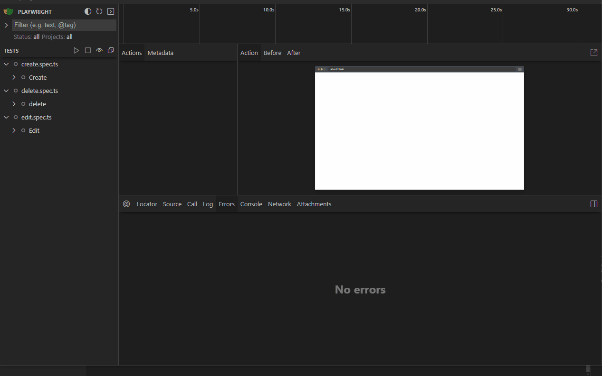

## Projeto CRUD Bevi

Este é um projeto CRUD simples utilizando React para a construção da interface do usuário (UI) e Playwright para testes automatizados. O objetivo é criar, ler, atualizar e excluir (CRUD) produtos de uma loja fictícia chamada Bevi.

## Pré-requisitos
Antes de iniciar a instalação, certifique-se de ter as seguintes ferramentas instaladas em seu sistema:

- <a target="_blank" href="https://nodejs.org/en">Node.js</a>
- <a target="_blank" href="https://www.git-scm.com/downloads">Git</a>

## Tecnologias Utilizadas

- <a target="_blank" href="https://react.dev">React</a>: Biblioteca JavaScript para construção de interfaces de usuário.
- <a target="_blank" href="https://playwright.dev">Playwright</a>: Ferramenta de automação de teste para aplicativos da web.
- <a target="_blank" href="https://tanstack.com">@tanstack/react-query</a>: Biblioteca para gerenciamento de estado e cache de dados na aplicação React.
- <a target="_blank" href="https://zod.dev">Zod</a>: Biblioteca para validação de esquemas de dados.
- <a target="_blank" href="https://sonner.emilkowal.ski">Sonner</a>: Biblioteca para exibir notificações na aplicação.

## Funcionalidades

- **Listagem de Produtos**: Visualização dos produtos cadastrados na loja.
- **Cadastro de Produtos**: Adição de novos produtos ao estoque.
- **Edição de Produtos**: Atualização das informações de um produto existente.
- **Exclusão de Produtos**: Remoção de produtos do estoque.

### Como Utilizar

1. **Instalação**: Clone o repositório e instale as dependências utilizando npm ou yarn:
    ```
      git clone https://github.com/seu-usuario/crud-bevi.git
      cd crud-bevi
      npm install
    ```

2. **Execução do Servidor de Desenvolvimento**: Execute o servidor de desenvolvimento para visualizar a aplicação no navegador:

    ```
      npm run dev
    ```

3. **Execução dos Testes Automatizados:**: Execute os testes automatizados utilizando o Playwright:

    ```
      npm test
    ```

## Componentes
### `Header`

O componente `Header` é responsável por exibir o cabeçalho da página, incluindo o título "Cadastro de Produtos" e um campo de busca.

### Exemplo de Uso
```jsx
export function Header() {
  return (
    <header className={styles["header-container"]}>
      <h1>Cadastro de Produtos</h1>

      <div className={styles.wrap}>
        <div className={styles.search}>
          <input name="search" type="text" placeholder="Nome do produto" onChange={(e) => setSearch(e.target.value)} />
          <button
            type="submit"
            className={styles.searchButton}
            onClick={() => handleSearchProductFilter()}
            data-testid="button-search"
          >
            <Search size={16} />
          </button>
        </div>
      </div>

      <Link to="/form?modal=true">
        <Plus size={16} />
        <span>Adicionar</span>
      </Link>
    </header>
  );
}
```

### `Table`

O componente Table é responsável por exibir uma tabela com os produtos cadastrados na loja. Ele também inclui funcionalidades como filtragem por nome, exclusão de produtos e edição de produtos.

### Propriedades
**Products: (array)** Uma matriz de objetos representando os produtos da loja. Cada objeto de produto deve ter as seguintes propriedades:
- **id: (number)** O ID único do produto.
- **name: (string)** O nome do produto.
- **description: (string)** A descrição do produto.
- **price: (number)** O preço do produto.
- **stock_quantity: (number)** A quantidade em estoque do produto.

### Exemplo de Uso
```jsx
export function Table() {
  return (
    <>
      <span>Quantidade de produtos: {isLoadingInfosProducts ? true : infosTable?.data?.length ?? 0}</span>
      <div className={`${styles["table-container"]} ${styles[String(infosProductsFn === undefined)]}`}>
        <table className={`${styles.table} ${styles[String(isLoadingInfosProducts)]}`}>
          <thead>
            <tr>
              <th>Nome</th>
              <th>Descrição</th>
              <th>Preço</th>
              <th>Status</th>
              <th>Quantidade no Estoque</th>
              <th>Ações</th>
            </tr>
          </thead>

          {isLoadingInfosProducts || (infosTable && infosTable?.data?.length === 0) ? (
            <SkeletonTable />
          ) : (
            <>
              <tbody>
                {infosTable?.data
                  ?.sort((data1: DataListProductsResponse, data2: DataListProductsResponse) => data1.id - data2.id)
                  .filter((product: DataListProductsResponse) =>
                    product.name.toLowerCase().includes(searchName.toLowerCase().trim()),
                  )
                  .map((product: DataListProductsResponse, index: Key) => (
                    <TableRow
                      product={product}
                      editProduct={editProduct}
                      openDeleteModal={openDeleteModal}
                      key={index}
                    />
                  ))}
              </tbody>
            </>
          )}
        </table>
      </div>

      {openModal.status && <ConfirmDialog openModal={openModal} setOpenModal={setOpenModal} />}
    </>
  );
}
```

### `Form`

O componente Form é responsável por exibir um formulário para adicionar ou editar produtos na loja. Ele inclui campos para inserir o nome, descrição, preço, quantidade em estoque e status do produto.

### Exemplo de Uso
```jsx
export function Form() {
  return (
    <div className={styles["form-container"]}>
      <div className={styles.form}>
        <header className={styles["header-form"]}>
          <div className={styles["header-form-title"]}>
            <Package size={22} />
            <h2>Cadastro de Produtos</h2>
          </div>

          <ChevronsLeft className={styles.return} size={24} onClick={() => handleModalClick()} />

          <span>Cadastre um novo produto para a sua loja!</span>
        </header>

        <form onSubmit={handleSubmit(submit)}>
          {inputs.map((input, index: Key) => (
            <Input
              name={input.name}
              placeholder={input.placeholder}
              register={register}
              error={errors}
              type={input.type}
              title={input.title}
              select={false}
              key={index}
            />
          ))}

          {edit && Object.keys(edit).length > 0 && (
            <Input
              register={register}
              error={errors}
              name="status"
              title="Status"
              handleChangeStatus={handleChangeStatus}
              select={true}
            />
          )}

          <button type="submit">{searchParams.get("edit") === "true" ? "Editar" : "Cadastrar"}</button>
        </form>
      </div>

      
    </div>
  );
}
```

## Detalhes dos Testes Automatizados
Os testes automatizados foram escritos utilizando Playwright e abrangem as seguintes funcionalidades:

1. **Cadastro de Produto:** Verifica se é possível adicionar um novo produto ao estoque.

2. **Mensagem de Erro no Cadastro:** Verifica se é exibida uma mensagem de erro ao tentar cadastrar um produto com dados inválidos.

3. **Validação dos Campos no Cadastro:** Verifica se as mensagens de erro são exibidas corretamente quando os campos do formulário de cadastro não são preenchidos corretamente.

4. **Listagem de Produtos:** Verifica se a listagem de produtos é exibida corretamente na tela principal.

5. **Exibição de Mensagem de Erro na Listagem:** Verifica se é exibida uma mensagem de erro quando não há produtos para listar.

6. **Edição de Produto:** Verifica se é possível editar as informações de um produto existente.

7. **Exclusão de Produto:** Verifica se é possível excluir um produto do estoque.

## Estrutura do Projeto
A estrutura do projeto está organizada da seguinte forma:
```
crud-bevi/
│
├── public/                   # Arquivos públicos
├── src/                      # Código fonte
│   ├── api/                  # Funções de solicitação de API
│         ├── mock/           # Funções de mock para simulação de requisições de API durante os testes.
│   ├── components/           # Componentes reutilizáveis
│   ├── util/                 # Funções utilitárias
│   ├── pages/                # Páginas principais
│   ├── App.tsx               # Componente App
│   ├── main.tsx              # Função principal
│   └── vite-env.d.ts         # Tipos de ambiente Vite
├── test/                     # Playwright testes
├── .eslintrc.js              # ESLint configuração
├── jest.config.js            # Jest configuração
├── package.json              # Dependências e scripts do projeto
├── tsconfig.json             # TypeScript configuração
└── vite.config.ts            # Vite configuração
```

## Playwright Testes
Playwright é usado para teste end-to-end.

#### Configuração do Playwright
A configuração do Playwright é definida em playwright.config.ts:
```
import { defineConfig } from "@playwright/test";

export default defineConfig({
  testDir: "./test",
  fullyParallel: true,
  forbidOnly: !!process.env.CI,
  retries: process.env.CI ? 2 : 0,
  workers: process.env.CI ? 1 : undefined,
  use: {
    baseURL: "http://localhost:50789",
  },
  webServer: {
    command: "npm run dev:test",
    url: "http://localhost:50789",
    reuseExistingServer: !process.env.CI,
  },
});
```

### Executando Testes
Para executar os testes no Playwright:

```
npx playwright test --ui
```

### Exemplo de Teste E2E
Abaixo está um exemplo de um teste e2e de registro de produto está sendo cadastrado corretamente:
```
test("should verify is the register product functionality  is right", async ({ page }) => {
    await page.goto("/", { waitUntil: "networkidle" });

    await page.getByRole("link", { name: "Adicionar" }).click();

    await page.locator('input[name="name"]').fill("Produto8");
    await page.locator('input[name="description"]').fill("Descrição do produto 8");
    await page.locator('input[name="price"]').fill("50");
    await page.locator('input[name="stock_quantity"]').fill("50");
    await page.getByRole("button", { name: "Cadastrar" }).click();
    expect(page.getByText("Produto8")).toBeVisible();

    await page.waitForTimeout(3000);
});
```

### Demo


## Testes Unitários com Jest
Além dos testes end-to-end com Playwright, este projeto também utiliza o Jest para testes unitários. Jest é um framework de teste em JavaScript que permite testar a lógica de sua aplicação de maneira isolada.

### Configuração do Jest
A configuração do Jest está definida no arquivo jest.config.js:
```
module.exports = {
  preset: "ts-jest",
  testEnvironment: "jsdom",
  testPathIgnorePatterns: ["/node_modules/", "/test"],
  setupFilesAfterEnv: ["./src/util/index.ts"],
  moduleNameMapper: {
    "^.+\\.(css|less|scss)$": "identity-obj-proxy",
  },
  transform: {
    "^.+\\.tsx?$": "ts-jest",
    "^.+\\.jsx?$": "babel-jest",
  },
  testEnvironmentOptions: {
    customExportConditions: [""],
  },
};
```

### Executando Testes Unitários
Para executar os testes unitários, utilize o seguinte comando:
```
npm run test
```

### Exemplo de Teste Unitário
Abaixo está um exemplo de um teste unitário de verificação de se os produtos da tabela estão sendo mostrados corretamente:
```
test("should display the table values correctly", async () => {
    const worker = setupServer(
      loginMock,
      getInfosProductsMock,
      registerProductMock,
      deleteProductMock,
      editProductMock,
    );
    await worker.listen();

    const { getAllByRole, getByText } = render(
      <QueryClientProvider client={queryClient}>
        <BrowserRouter>
          <App />
        </BrowserRouter>
      </QueryClientProvider>,
    );

    await waitFor(
      () => {
        expect(getAllByRole("row")).toHaveLength(5);
        expect(getByText("Produto1")).toBeInTheDocument();
        expect(getByText("Produto2")).toBeInTheDocument();
        expect(getByText("Produto3")).toBeInTheDocument();
        expect(getByText("Produto4")).toBeInTheDocument();
      },
      { timeout: 2000 },
    );
  });
```

## Demos Páginas


<hr />
<p>Alerrando © 2024 Obrigado por acessar</p>